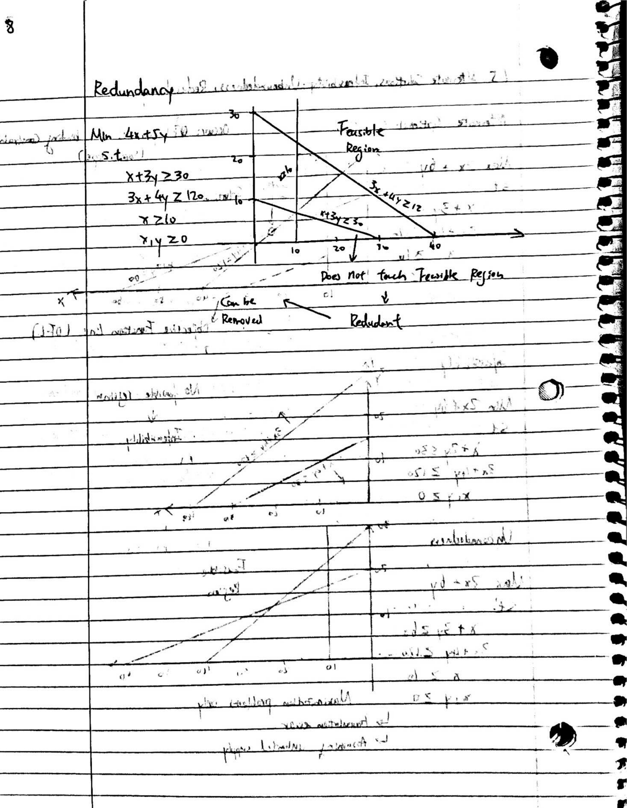

```{r setup, include=FALSE}
knitr::opts_chunk$set(echo = FALSE)
library(tidyverse)
library(lpSolve)
```

# Credits

The "Intro to Linear Programming" series by Joshua Emmanuel [Playlist Link Here](https://www.youtube.com/playlist?list=PLD3fYc0bAjC-Wc4icC2F34Bry3oLpFb8B)


# Notes

<p>

{width=50%}{width=50%}
<p>

{width=50%}{width=50%}

{width=50%}{width=50%}

{width=50%}{width=50%}

{width=50%}{width=50%}

# Programming Application (R)

## Problem Statement

<p>
A company produces two models of chairs: 4P and 3P. The model 4P needs 4 legs, 1 seat and 1 back. On the other hand, the model 3P needs 3 legs and 1 seat. The company has a initial stock of 200 legs, 500 seats and 100 backs. If the company needs more legs, seats and backs, it can buy standard wood blocks, whose cost is 80 euro per block. The company can produce 10 seats, 20 legs and 2 backs from a standard wood block. The cost of producing the model 4P is 30 euro/chair, meanwhile the cost of the model 3P is 40 euro/chair. Finally, the company informs that the minimum number of chairs to produce is 1000 units per month. Define a linear programming model, which minimizes the total cost (the production costs of the two chairs, plus the buying of new wood blocks).
<p>

Credit: “Modeling and Solving Linear Programming with R” by Jose M. Sallan, Oriol Lordan and Vincenc Fernandez. Page 57, section 3.5 and [R bloggers](https://www.r-bloggers.com/2018/08/linear-programming-in-r/).

- $x_{4p}$ is the number of 4P chairs to be produced.
- $x_{3p}$ is the number of 3P chairs to be produced.
- $x_w$ is the number of wood blocks to be bought.

Now we can define $\hat X = \begin{pmatrix} x_{4p} \\ x_{3p}  \\  x_w \end{pmatrix}$ as the decision variable vector. Note that it must be $\hat X \geq 0$.

We would like to minimize the total cost so we must set our objective function as follows

$$cost(x_{4p}, x_{3p}, x_w) = 30 x_{4p} + 40 x_{3p} + 80 x_w = MIN(cost) $$

which means that $\hat C = \begin{pmatrix} 30 \\ 40  \\  80 \end{pmatrix}$.

```{r}

```


