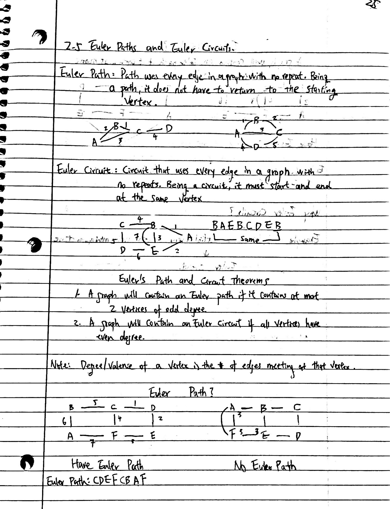
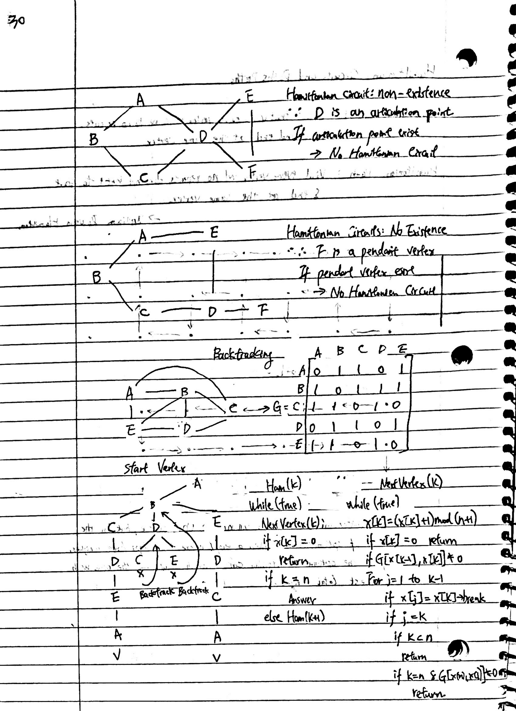

```{r setup, include=FALSE}
knitr::opts_chunk$set(echo = FALSE)
```

# Concepts

{width=50%}{width=50%}
{width=50%}{width=50%}

{width=50%}{width=50%}

{width=50%}{width=50%}

{width=50%}{width=50%}

{width=50%}{width=50%}

{width=50%}{width=50%}

{width=50%}{width=50%}

{width=50%}{width=50%}


