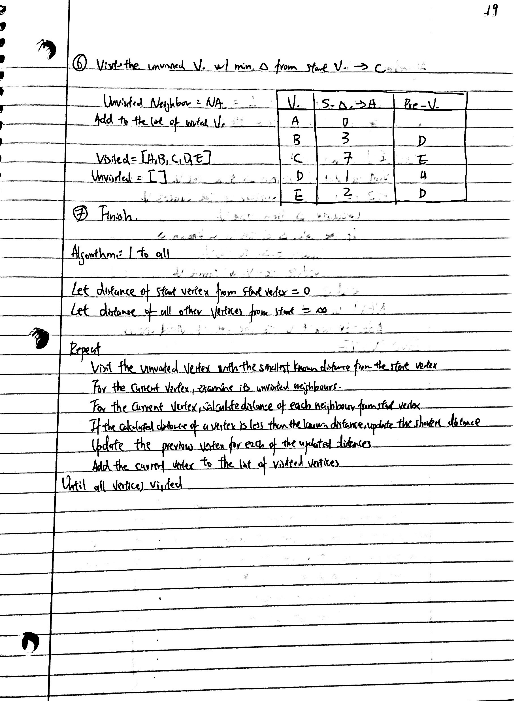
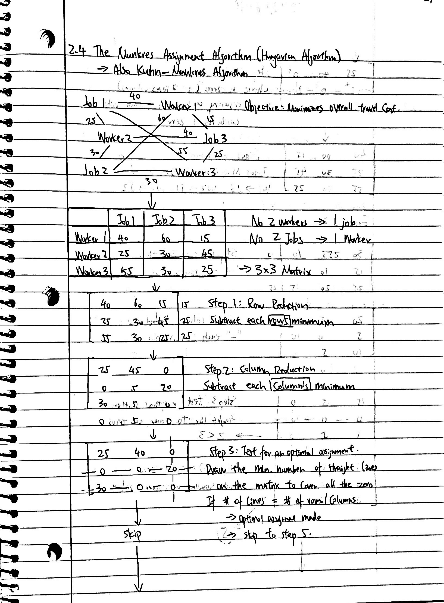
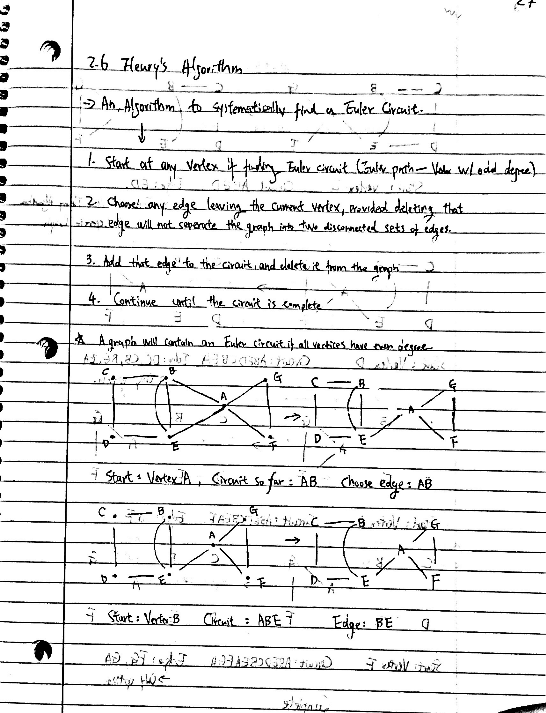
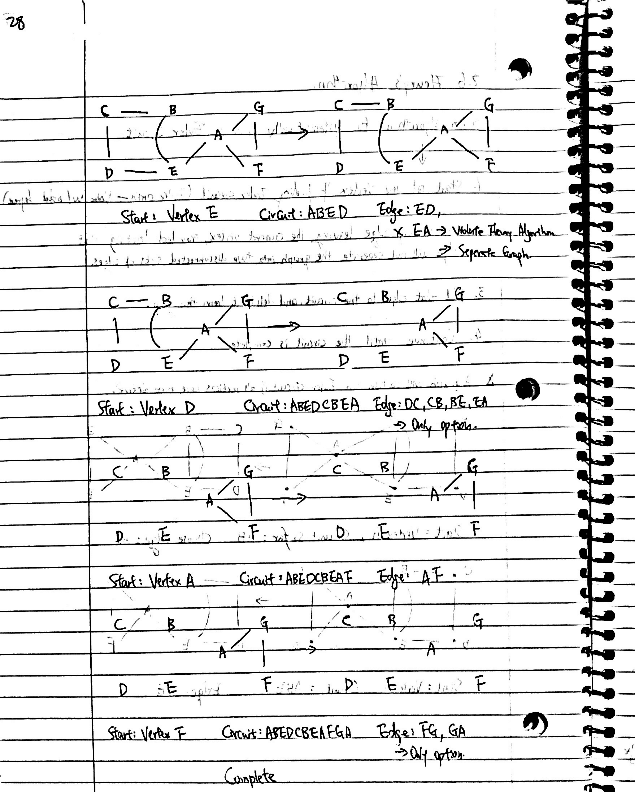

```{r setup, include=FALSE}
knitr::opts_chunk$set(echo = FALSE)
library(tidyverse)
library(shiny)
```

# Credits

"Graph Data Structure 1. Terminology and Representation (algorithms)" by Computer Science [Video Link Here](https://www.youtube.com/watch?v=c8P9kB1eun4&list=PLTd6ceoshprdS7HVI-Yus4rAHtrqNzH0j&index=16)

"Graph Data Structure 3. Traversing a Graph (algorithms)" by Computer Science [Video Link Here](https://www.youtube.com/watch?v=ymlzHmRN4To&list=PLTd6ceoshprdS7HVI-Yus4rAHtrqNzH0j&index=18)

"Graph Data Structure 4. Dijkstra’s Shortest Path Algorithm" by Computer Science [Video Link Here](https://www.youtube.com/watch?v=pVfj6mxhdMw&list=PLTd6ceoshprdS7HVI-Yus4rAHtrqNzH0j&index=19)

"The Munkres Assignment Algorithm (Hungarian Algorithm)" by CompSci [Video Link Here](https://www.youtube.com/watch?v=cQ5MsiGaDY8)

"Graph Theory: Euler Paths and Euler Circuits" by Mathispower4u [Video Link Here](https://www.youtube.com/watch?v=5M-m62qTR-s)

"Graph Theory: Fleury's Algorthim" by Mathispower4u [Video Link Here](https://www.youtube.com/watch?v=vvP4Fg4r-Ns)

"Graph Theory: Hamiltonian Circuits and Paths" by Mathispower4u [Video Link Here](https://www.youtube.com/watch?v=AamHZhAmR7o)

"6.4 Hamiltonian Cycle - Backtracking" by Abdul Bari [Video Link Here](https://www.youtube.com/watch?v=dQr4wZCiJJ4)

# Notes

{width=50%}{width=50%}
{width=50%}{width=50%}

{width=50%}{width=50%}

{width=50%}{width=50%}

{width=50%}{width=50%}

{width=50%}{width=50%}

{width=50%}{width=50%}

{width=50%}{width=50%}

{width=50%}{width=50%}

{width=50%}


