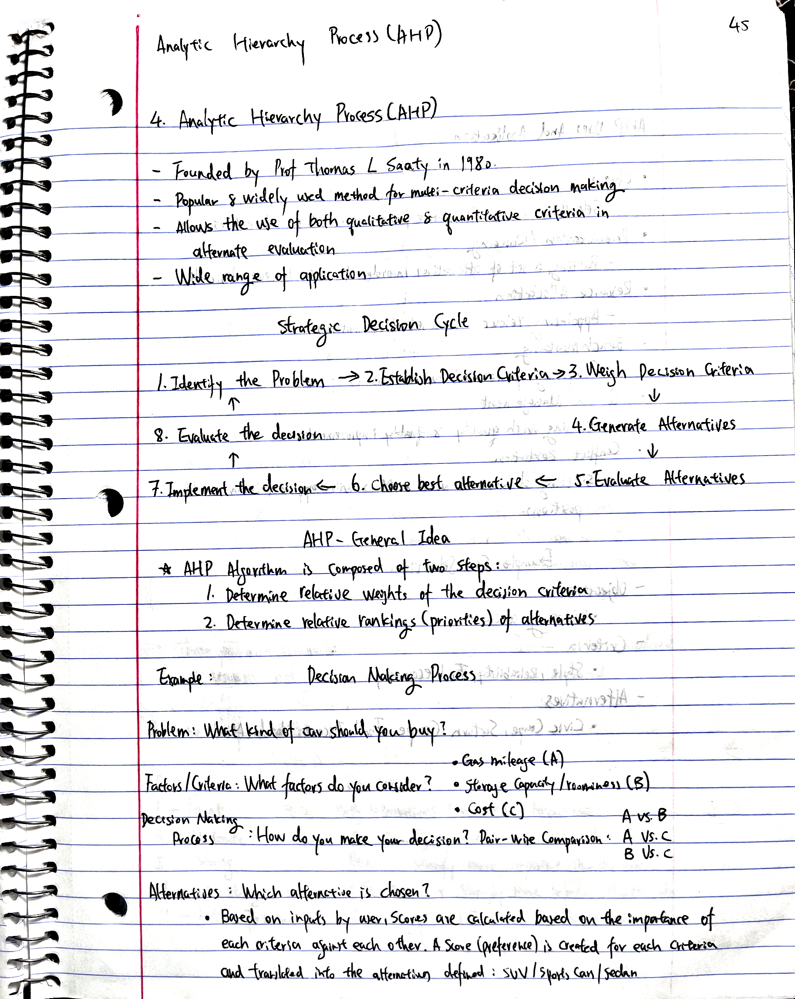
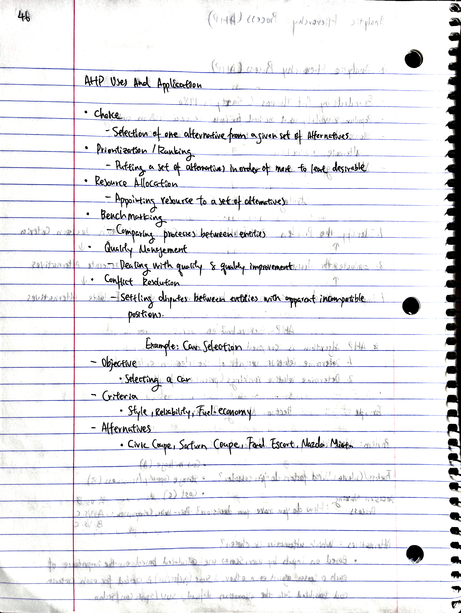
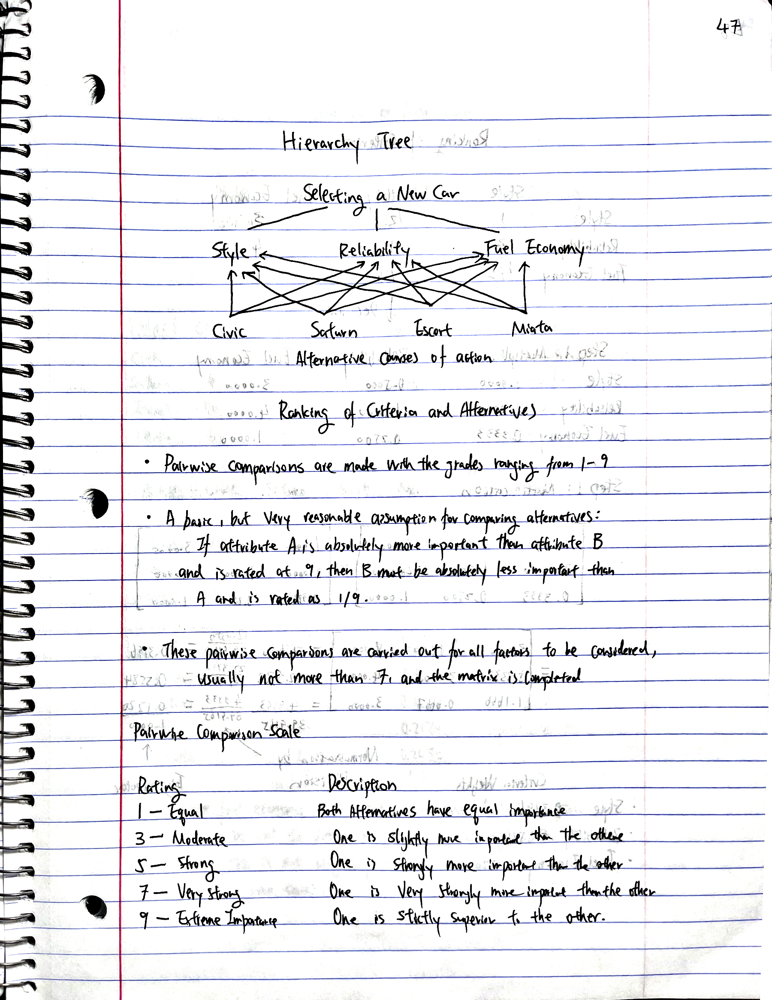
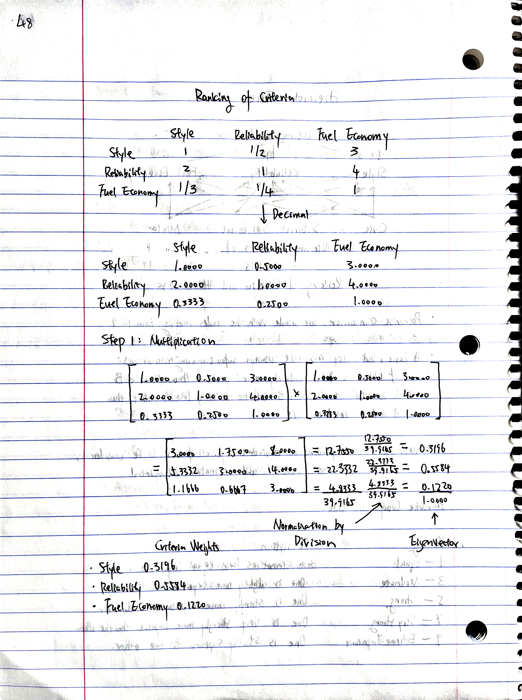
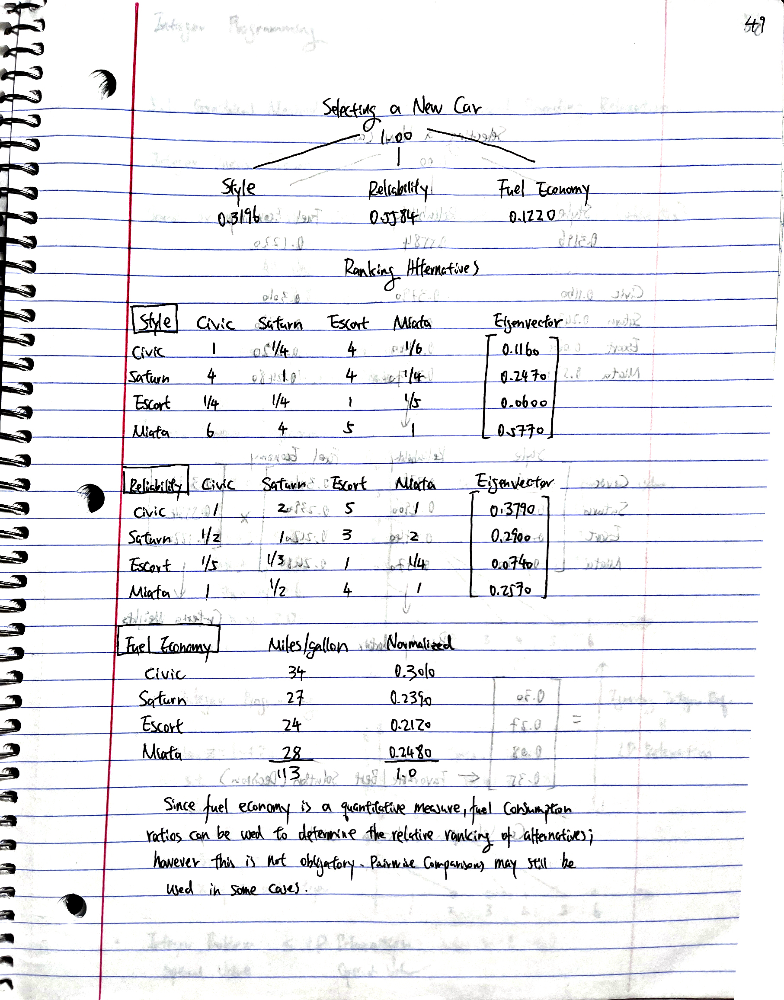
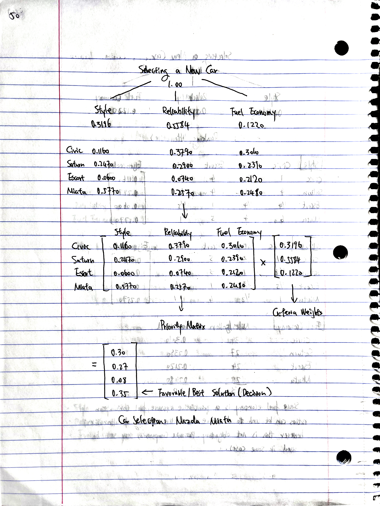

```{r setup, include=FALSE}
knitr::opts_chunk$set(echo = FALSE)
```

# Credits

"Analytical Hierarchy Process" by CBAKhan [Video Link Here](https://www.youtube.com/watch?v=sExZVh5GTdk)

# Notes

{width=50%}{width=50%}

{width=50%}{width=50%}
{width=50%}{width=50%}


